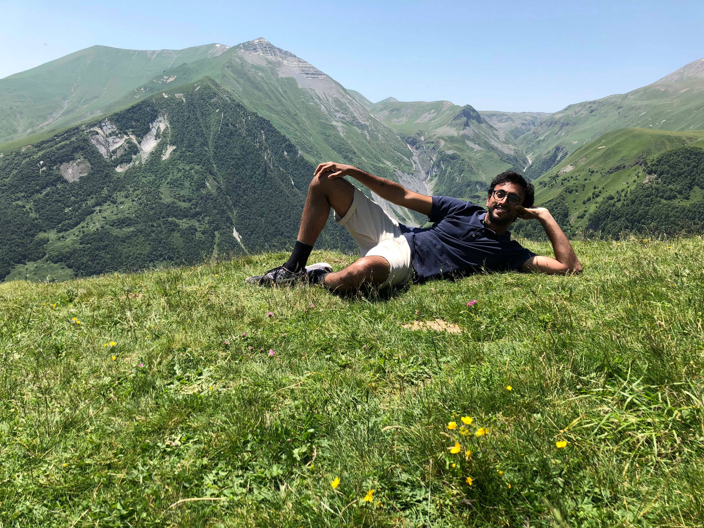

# me_irl

<i>Posing for your viewing pleasure @ Gudauri, Georgia (the country)</i>

Howdy, I'm Aarav. I like looking at cool infosec exploits, reading philosophy, and collecting vintage Soviet space propaganda posters.
I was educated as an aerospace engineer (UIUC '17), then a operations researcher (read: mathematical optimization) (NEU '19), and I now work as a security analyst. 

I started this as a way for me to document my OSCP l33t h4x0r journey, but I think  I'm going to use this website as part-technical-notebook and part-blog (so expect a lot of rambling!). I'm also tremendously indebted to the wonderful infosec community that has always selflessly curated and circulated troves of open-source knowledge for us noobs, so a <u><b>massive</b></u> shout out to them, and I hope this can serve others too.

Here's a link to <a href="https://www.goodreads.com/user/show/90067195-aarav-balsu">the books I read</a>, my [resume](/Northeastern%20Resume%2012.pdf) and my <a href="https://github.com/aaravbalsu">GitHub</a>.

If you want to get in touch with me, hit me up on <a href="https://twitter.com/DoYouEvenBrown">Twitter</a> or email me at ping00 [at] protonmail [dot] com. My handle comes from <a href="https://www.youtube.com/watch?v=V3BWUN24TJc">this delightful show </a> that I watched growing up. Give it a go, you're in for a treat!

Back to [Home](/README.md)!
